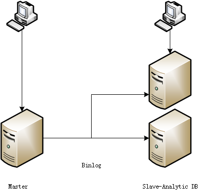

# concept

为存储层提供以下能力：
1. 实时流式数据写入
2. 分布式存储方案，线性扩展
3. 提供上层的spark connector
4. 提供上层的jdbc driver
5. 提供上层的缓存读取写入，提升实时应用能力

## 服务器升级思路

用多个mysql组成分布式存储，使用分库分表的方式作为分布策略，通过多节点和读写分离提升性能

### 第一次扩容

增加服务器的计算能力，实现计算业务的增强
- 从单服务器到主从服务器(如单主压力大，可以实现多主)
- 使用SmartSQL基于从库实现计算查询

### 第二次扩容

实现服务能力的线性扩展，持续提升处理能力
- 从主从服务器到分布式中间件
- 使用SmartSQL支持分布式中间件的分布式存储策略，实现分布式计算

### 第三次扩容

优化整体架构，优化性能，使用SmartSQL实现一体化的服务能力线性扩展

## 常见存储引擎

2018-9

- Oracle **
- mysql **
- MS-SQL *
- Postgres **
- MongoDB **
- DB2
- ElasticSearch **
- Redis
- MS-Access
- Cassandra *
- SQLite
- Teradata
- Splunk
- MariaDB *
- Solr *
- Hive *
- HBase **
- SAP Adaptive Server
- FileMaker
- Amazon DynamoDB
