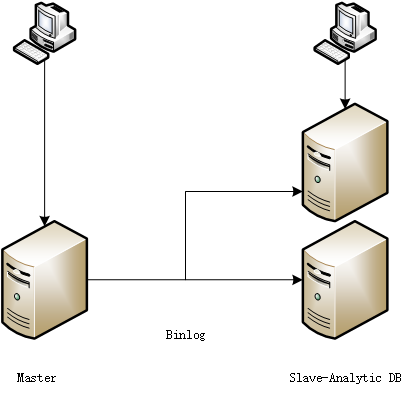

# concept

假设SmartSQL一开始以单机的方式，接入到常见的业务系统中，为业务系统提供智能计算能力，
那么在实际操作的过程中，会面临系统逐步升级的场景，以下是面对mysql生态的解决思路

## 服务器升级思路

### 第一次扩容

增加服务器的计算能力，实现计算业务的增强
- 从单服务器到主从服务器(如单主压力大，可以实现多主)，实现主服务器的数据入库，如使用tokudb保存日志
- 使用SmartSQL基于从库实现计算查询

### 第二次扩容

实现服务能力的线性扩展，持续提升处理能力
- 从主从服务器到分布式中间件，用多个mysql组成分布式存储，使用分库分表的方式作为分布策略，通过多节点和读写分离提升性能
- 使用SmartSQL支持分布式中间件的分布式存储策略，实现分布式计算

### 第三次扩容

优化整体架构，优化性能，使用SmartSQL实现一体化的服务能力线性扩展，实现无感知扩容
